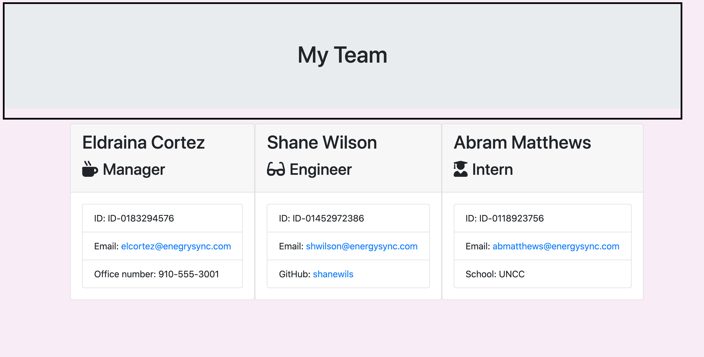

# TeamProfile

# Project Description
To create a city search forecast application that searches for build a software engineering team generator command line application. The application will prompt the user for information about the team manager and then information about the team members. The user can input any number of team members, and they may be a mix of engineers and interns. This assignment must also pass all unit tests. When the user has completed building the team, the application will create an HTML file that displays a nicely formatted team roster based on the information provided by the user.

* This project utilizies Node CLI to takes in information about employees and generates an HTML webpage that displays summaries for each person. Jest will be utilized for testing to ensure that all units pass and the code is maintained.  

# Demo Features:
* The following image and gif shows the web application's appearance and functionality:

# Live URL:
<a href="https://youtu.be/3WCP28esXRA">Team Profile Youtube</a>

<a href="https://github.com/sjohn214/TeamProfile.git">Team Profile GitHub Repo</a>

# Summary
* In this project we created an employment profile for all members of a department, "Manager, Engineer, and Intern. 

# Special Features:
* HTML page
  * 5 Index.html
    * Created an html page for each employee and the main.html.
* CSS elements 
  * Bootstrap and in-line css stlying on main.html.
* Javascript page
  * Node CLI
  * Arrays with objects
  * Jquery language: inquirer, fileSync, path, and fs 
  * Test with Jest
  * Functions
  * Installed npm package
  * Istalled package-json

# Authors
* Shannondale Page (student) <a href="https://github.com/sjohn214">Git Hub Profile</a>
* Austin Bruch (Bootcamp Instructor)
* Jon Jackson (Bootcamp TA Instructor)
* Daniel Sires (Bootcamp Tutor)